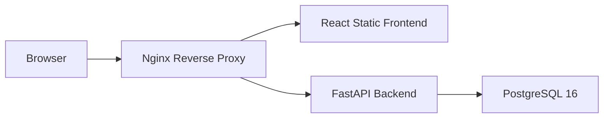

# AlertHub Safe City Architecture

AlertHub Safe City is an independent monitoring analytics platform. Discord is the primary and
default event source. Zabbix API and Zabbix Database support are optional connector modules that are
disabled by default.

## Sprint 1 Scope

- FastAPI backend infrastructure
- React frontend infrastructure
- PostgreSQL 16 service
- Alembic migration configuration
- Nginx reverse proxy
- Docker Compose orchestration
- Modular connector engine

Business features, persistent event ingestion, reporting, analytics, and authentication are outside Sprint 1.

## Runtime Topology

## Backend Layers

- `api`: HTTP routing and endpoint composition
- `connectors`: source-specific connector engine and normalized event contracts
- `core`: settings, logging, lifecycle, and exception handling
- `database`: SQLAlchemy engine, sessions, and declarative base
- `models`: future persistence models
- `schemas`: Pydantic response and request schemas
- `services`: future application services
- `utils`: shared utilities

## Connector Architecture

Connectors implement `BaseConnector` and normalize source payloads into a common `ConnectorEvent`
model with `source`, `problem_id`, `host`, `severity`, `status`, `problem_name`, `started_at`,
`resolved_at`, `duration`, and `raw_payload`.

Configured connectors:

- Discord: default connector, enabled by default
- Zabbix API: optional, disabled by default
- Zabbix Database: optional read-only connector, disabled by default
- REST API, Syslog, Wazuh, Grafana, and Cacti are reserved for future connector modules

Runtime selection is environment-based:

- `EVENT_SOURCE=discord`
- `EVENT_SOURCE=zabbix_api`
- `EVENT_SOURCE=zabbix_database`
- `EVENT_SOURCE=multiple`
- `CONNECTOR_IMPORTS=my_package.connectors.CustomConnector`

When `EVENT_SOURCE=multiple`, every enabled connector is started concurrently. Connector status is
available at `/connectors` and `/api/v1/connectors`.

Future connector modules can be registered through `CONNECTOR_IMPORTS` without editing the default
factory. Each imported class must subclass `BaseConnector` and define a unique `source` key.

## Frontend Layers

- `components/layout`: application shell components
- `pages`: route-level views
- `services`: API client configuration
- `styles`: TailwindCSS entrypoint
